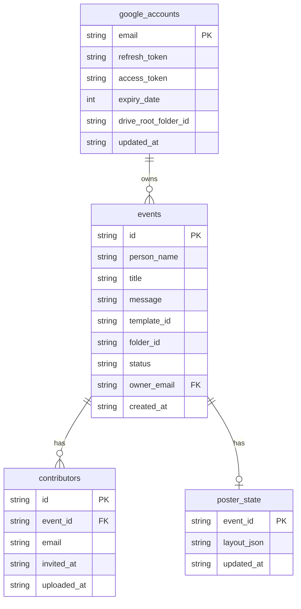
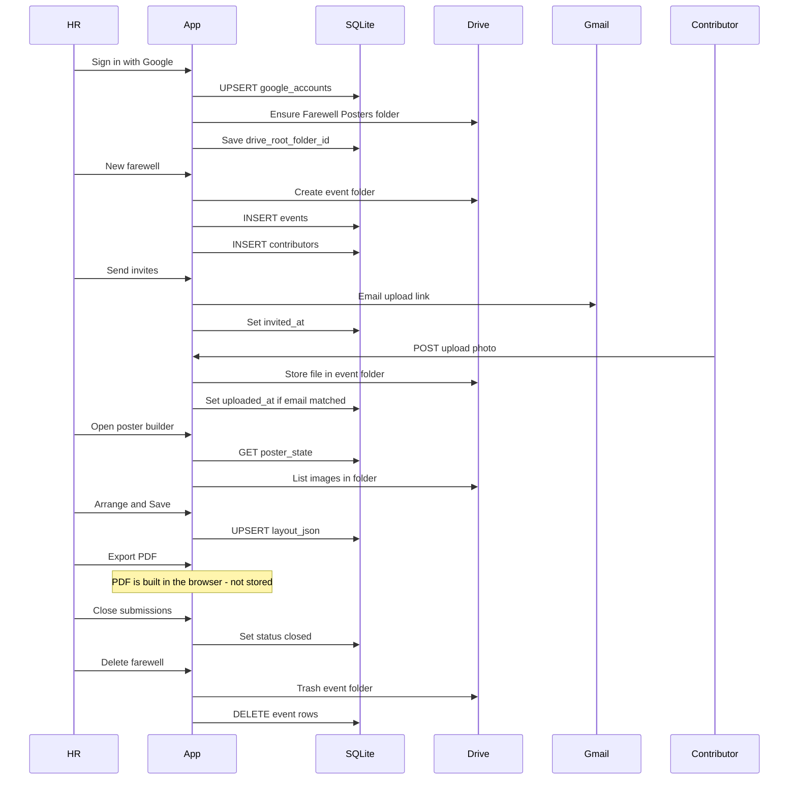

# Data model — SQLite + Drive

The app uses **two stores**. SQLite is metadata and Google tokens. Google Drive is every photo (and later, a PDF if you add that). Nothing image-binary is written to SQLite.

File on disk: `data/farewell.db` (plus `-wal` / `-shm` while the app is running).

---

## Split of responsibility

```
┌─────────────────────────────────────────────────────────┐
│  SQLite  (data/farewell.db)                             │
│  google_accounts  HR OAuth tokens + Drive root folder   │
│  events           farewell record + Drive folder id     │
│  contributors     who was invited / who uploaded        │
│  poster_state     page size + where photos sit (JSON)   │
└─────────────────────────────────────────────────────────┘
                         │ folder_id
                         ▼
┌─────────────────────────────────────────────────────────┐
│  Google Drive  (signed-in HR account)                   │
│  Farewell Posters/                 ← drive_root_folder  │
│    └── {person} - {month year}/    ← events.folder_id   │
│          ├── note-….jpg            ← contributor photos │
│          └── (optional later) poster.pdf                │
└─────────────────────────────────────────────────────────┘
```

HR login itself is **not** a SQLite row. It is an HMAC cookie (`farewell_session`) that only stores the email. Tokens live in `google_accounts`.

---

## Tables

Open **[data-schema.mmd](./data-schema.mmd)** in Mermaid Preview if the block below does not render inside Markdown.



There is **no photos table**. A photo is a Drive file. The poster only stores that file’s Drive id inside `layout_json`.

### `google_accounts` — one row per HR Gmail

Written on Google sign-in. Used whenever the server talks to Drive or Gmail (create folder, upload, send invites, proxy an image).

| Column | Meaning |
| --- | --- |
| `email` | Google account |
| `refresh_token` | Long-lived; lets the app write to Drive while HR is offline |
| `access_token` / `expiry_date` | Short-lived, refreshed automatically |
| `drive_root_folder_id` | Drive folder named **Farewell Posters** |

### `events` — one row per farewell

| Column | Meaning |
| --- | --- |
| `id` | Public id (`nanoid`, 10 chars). Used in `/upload/{id}`, `/poster/{id}` |
| `person_name` | Who is leaving |
| `title` | Internal label on the dashboard |
| `message` | Text in the invite email and on the upload page |
| `template_id` | Leftover; always `freeform` now |
| `folder_id` | Drive folder for this event’s photos |
| `status` | `open` or `closed` (closed = upload link rejects new files) |
| `owner_email` | Whose Drive/Gmail to use |
| `created_at` | UTC timestamp |

Dashboard lists **all** events (not filtered by owner). Delete is owner-only.

### `contributors` — people on the invite list

Unique on `(event_id, email)`.

| Column | Meaning |
| --- | --- |
| `email` | Lowercased |
| `invited_at` | Set when Gmail send succeeded |
| `uploaded_at` | Set when `/upload` receives a file **and** they typed that email |

A photo can exist in Drive even if `uploaded_at` is null (they skipped the email field, or HR added extras).

### `poster_state` — at most one row per event

Created on first **Save** in the poster builder. Until then the builder uses a default A4 empty layout in the browser only.

`layout_json` example:

```json
{
  "page": { "widthMm": 210, "heightMm": 297 },
  "items": [
    {
      "id": "browser-uuid",
      "imageId": "GOOGLE_DRIVE_FILE_ID",
      "x": 40,
      "y": 80,
      "width": 220,
      "height": 160,
      "rotation": 15,
      "z": 2
    }
  ]
}
```

`x` / `y` / `width` / `height` are pixels on the 150 DPI page, not millimetres. `imageId` is the Drive file id, not a SQLite key.

---

## Lifecycle (what gets written when)

Open **[data-lifecycle.mmd](./data-lifecycle.mmd)** in Mermaid Preview if the block below does not render inside Markdown.



---

## What is **not** in SQLite

| Data | Where it lives |
| --- | --- |
| Photo bytes | Drive files in the event folder |
| Finished PDF | Browser download only (not saved server-side) |
| Logged-in session | Signed cookie, 7 days |
| Who may log in | `ALLOWED_GOOGLE_EMAILS` in env, not the db |

---

## If you later switch to Supabase

Map tables 1:1. Use **Postgres** for the four tables (especially `google_accounts.refresh_token`). Use **Supabase Storage** only if you want to replace Drive for images — that is a product change (HR would no longer see folders in Drive).

| SQLite | Supabase |
| --- | --- |
| `google_accounts` | `google_accounts` (lock this table down; tokens are secrets) |
| `events` | `events` |
| `contributors` | `contributors` |
| `poster_state.layout_json` | `jsonb` column on `events`, or a `poster_state` table |
| Drive folder + files | Keep Drive, **or** a Storage bucket `events/{id}/` |

You still need the refresh token in Postgres if contributors upload while HR is offline. Storage alone is not enough.

Row Level Security: this app is a shared HR list, so a service-role server (API routes) is simpler than per-user RLS unless you change that rule.
